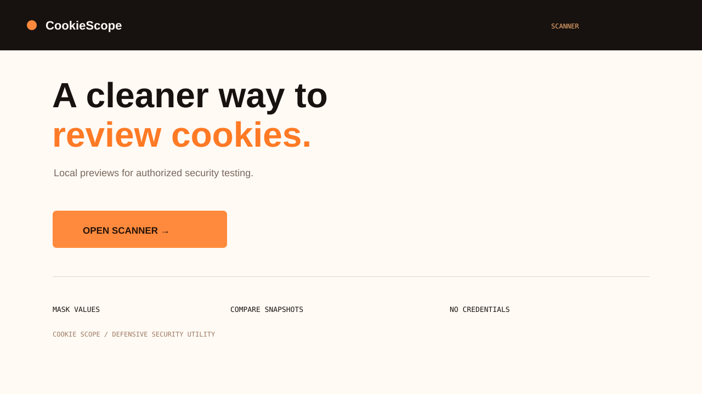
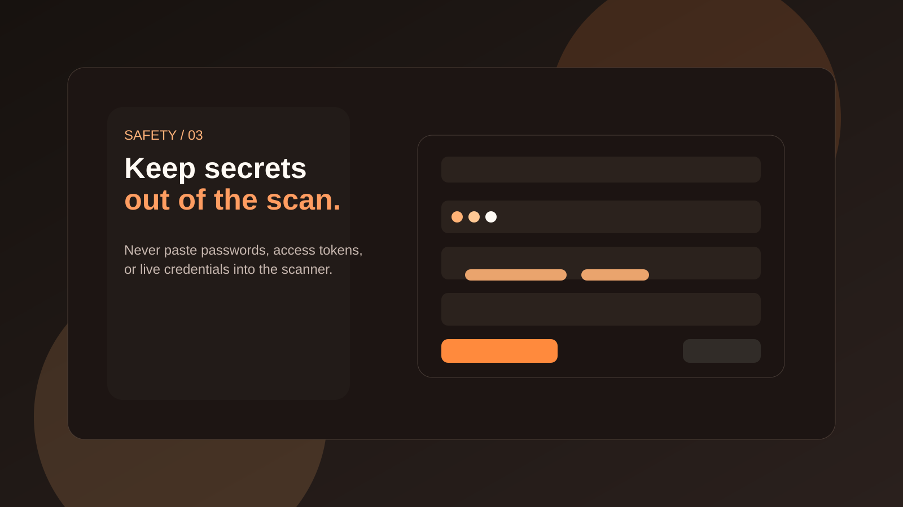
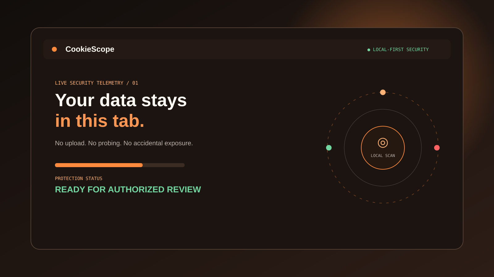
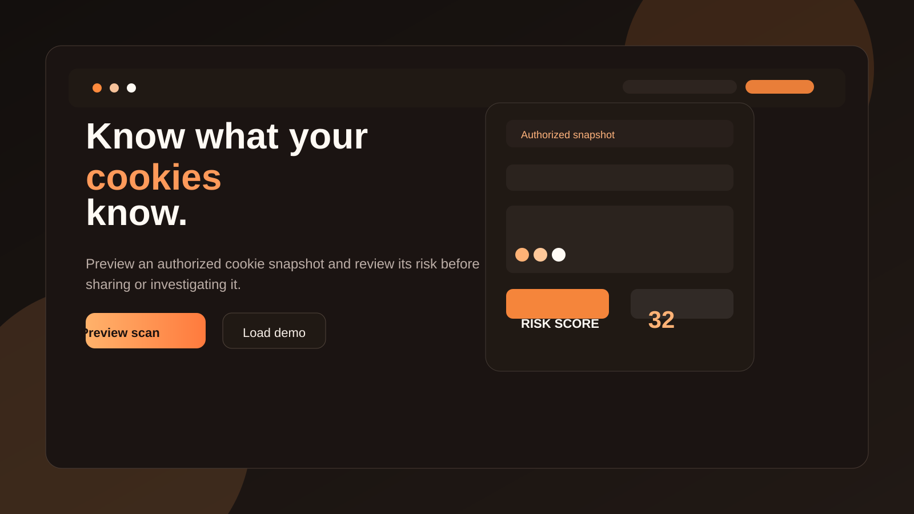

# CookieScope


A polished, local-first cookie security scanner for defensive and authorized audits.

## Screenshots

| Scanner | Risk report |
| --- | --- |
|  |  |

| Security motion system | Privacy workflow |
| --- | --- |
|  |  |

## Publish it as a website

This repository is already structured as a static website and can be published with GitHub Pages.

1. Open Settings → Pages in the repository.
2. Choose Deploy from a branch.
3. Select the `main` branch and `/ (root)` folder.
4. Save the site.
5. Open the published URL: `https://gefrus112.github.io/cookiescanner/`

To run locally instead:

```bash
python3 -m http.server 8000
```

Then visit <http://localhost:8000>.

## What it does

- Uses orange-and-white tabs for Scanner, Features, and Safety.
- Accepts an authorized website URL as context and a cookie snapshot for local review.
- Supports General audit, Before sign-in, After sign-in, and After sign-out labels.
- Shows masked cookie previews by default with an optional Show values toggle.
- Highlights session, tracking, consent, and security-like cookie names.
- Displays a local risk score and findings list.
- Includes multiple thumbnails for GitHub and showcase use.

## Safety rules

CookieScope is a defensive review aid, not an exploitation or credential-recovery tool.

- Use it only on systems, sites, or cookie snapshots you own or are explicitly authorized to assess.
- Never paste passwords, API keys, bearer tokens, email addresses, payment data, or live production credentials.
- Treat cookie values as secrets. Keep the preview masked and reveal only when necessary for a legitimate review.
- The website URL is context only. CookieScope does not log in, crawl, probe, bypass controls, or read another site's cookies.
- Verify cookie attributes such as `Secure`, `HttpOnly`, `SameSite`, `Domain`, expiry, and scope using an authorized browser or proxy workflow.
- Do not use findings to access an account, impersonate a user, or evade security controls.
- Delete exported snapshots after the approved review and follow your organization's retention policy.
- Use on your own: This tool is intended for your own authorized testing, internal reviews, or defensive security work.

## Privacy model

The scanner processes pasted text in browser memory only. It is designed to keep analysis local and does not require a backend. Refreshing or closing the page clears the working state. If you need a fully offline deployment, remove the Google Fonts stylesheet from the page and keep the site local-only.

## License

Use this project responsibly and only within the permissions of the system owner.
