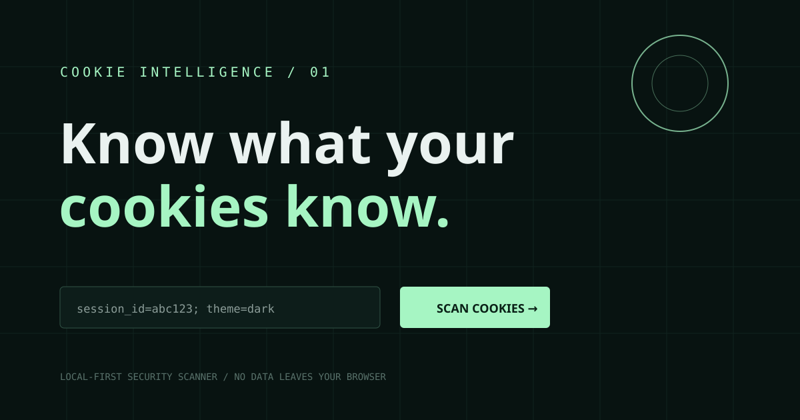

# CookieScope

A local-first cybersecurity cookie scanner for defensive, authorized audits. Paste a `Cookie` header or `document.cookie` snapshot and get a quick risk report in your browser.



## Features

- Parses cookie names and values locally — cookie data is never sent to a server.
- Accepts a website URL as report context, without crawling or contacting that website.
- Labels snapshots as general audit, before sign-in, after sign-in, or after sign-out so you can compare lifecycle states manually.
- Flags names that may represent sessions, authentication tokens, CSRF tokens, or personal data.
- Shows a risk score, findings, cookie count, and a thumbnail preview in this README.

## Run it

Open `index.html` directly, or serve the folder with any static server:

```bash
python3 -m http.server 8000
```

Then visit <http://localhost:8000>.

## Important safety and scope

Do **not** enter an email address, password, access token, or live credential into this tool. An email address is not required for cookie analysis. The app only needs a cookie snapshot that you are authorized to inspect.

A regular browser page cannot read cookies belonging to an unrelated website because of the same-origin policy. Therefore, the URL field is context only; this app does not automatically log in, log out, crawl, probe, or scan another site. To assess lifecycle behavior, capture authorized snapshots yourself before sign-in, after sign-in, and after sign-out, then run each snapshot with the matching label.

This is a review aid, not a complete penetration test. Cookie attributes such as `Secure`, `HttpOnly`, `SameSite`, `Domain`, and `Expires` are available for review when captured from an authorized browser or proxy response, but a plain `document.cookie` string does not include all of them.
